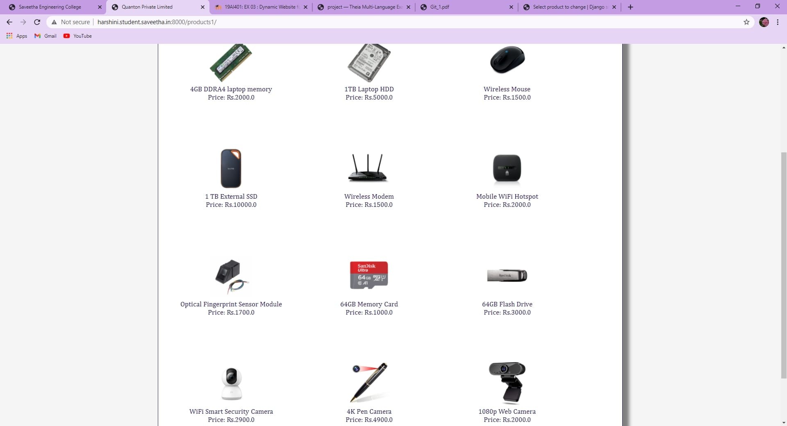
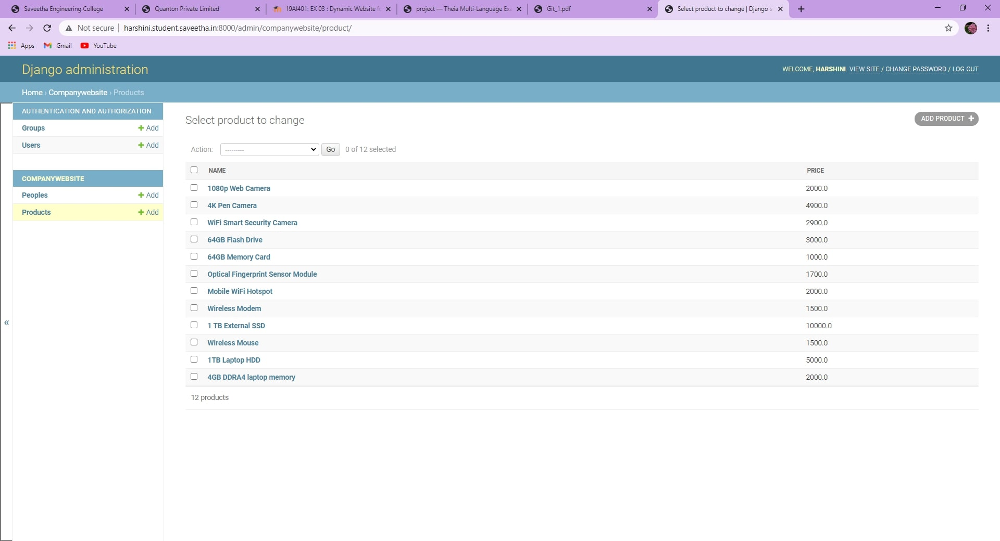
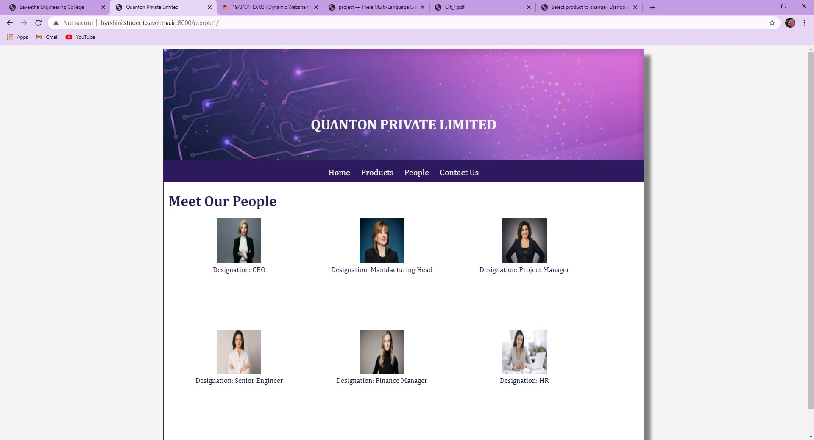
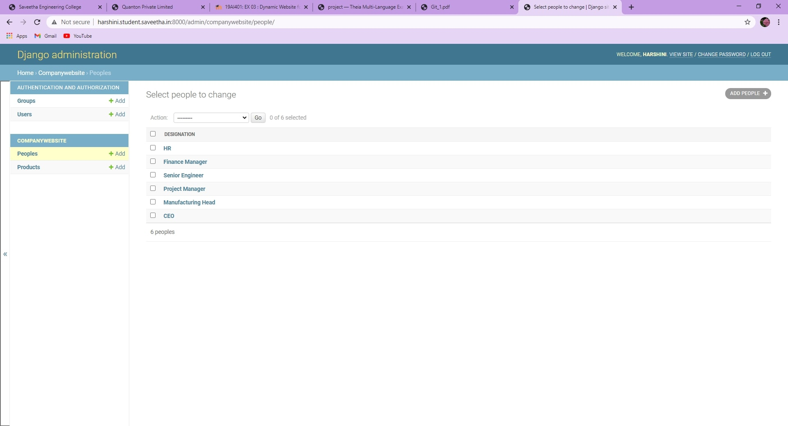

# Dynamic Website Design for a Manufacturing Company
## AIM:
To design a dynamic website for a chip manufacturing company.

## DESIGN STEPS:
### Step 1: 
Requirement collection.
### Step 2:
Creating the layout using HTML and CSS.
### Step 3:
Updating the sample content.
### Step 4:
Choose the appropriate style and color scheme.
### Step 5:
Validate the layout in various browsers.
### Step 6:
Validate the HTML code.
### Step 7:
Create a database model and migrate the database.
### Step 8:
Retrieve data from database and display it in a dynamic webpage.
### Step 9:
Publish the website in the given URL.

## PROGRAM:

### base.html
```

<!DOCTYPE html>
<html lang="en">

<head>
    <title>Quanton Private Limited</title>
    <link rel="stylesheet" href="">
    <link rel="icon" href="" type="image/x-icon">

</head>

<body>
    <div class="container">
        <div class="banner">
            <b> QUANTON PRIVATE LIMITED</b>
        </div>
        <div class="menu">
            <div class="menuitem"><a href="/home1">Home</a></div>
            <div class="menuitem"><a href="/products1">Products</a></div>
            <div class="menuitem"><a href="/people1">People</a></div>
            <div class="menuitem"><a href="/contact1">Contact Us</a></div>
        </div>
        <div class="content">
            
            
        </div>
        <div class="footer">
            Copyright © 2020 Quanton Private Limited, Developed by Harshini.
        </div>
    </div>
</body>

</html>
```

### home.html
```



<div class="homecontent">
    <h1>About Us</h1>
    
    <div class="contenttext">
        Silicon Pvt Ltd, provides a broad range of semiconductor and infrastructure software applications that serve the
        data center, networking, software, broadband, wireless, and storage and industrial markets. Common applications
        for its products include: data center networking, home connectivity, broadband access, telecommunications
        equipment, smartphones, base stations, data center servers and storage, factory automation, power generation and
        alternative energy systems, displays, and mainframe operations and management, and application software
        development. Some of Silicon's core technologies and products include:
        <ul>
            <li>Memory Chips</li>
            <li>SATA HDD</li>
            <li>SATA SSD </li>
            <li>Broadband Modems</li>
            <li>Wifi Devices</li>
            <li>Switching Devices</li>
            <li>Optical Sensors</li>
        </ul>
    </div>
</div>

```
### products.html
```



<div class="productcontent">
    <h1>Our Premium Products</h1>
    <div class="productitems">
        
        <div class="productitem">
            <div class="itemimage">
                
            </div>
            <div class="itemname">{{ product.name }}</div>
            <div class="itemprice">Price: Rs.{{ product.price }}</div>
        </div>
        
    </div>
</div>

```
### people.html
```



<div class="productcontent">
    <h1>Meet Our People</h1>
    <div class="productitems">
        
        <div class="productitem">
            <div class="itemimage">
                
            </div>
            <div class="itemname">Designation: {{ people.designation }}</div>
        </div>
        
    </div>
</div>

```
### contact.html
```



<h1>Reach Us</h1>
<ul>
    <li><b>Call Us :</b> +91 9832466007</li>
    <li><b>E-mail Us :</b> quanton@company.com</li>
    <li><b>Address :</b><br>

        <br>
        <ul style="list-style-type:square;">
            <li>
                <u>London Office :</u> <br>
                10 Downing Street<br>
                London<br>
                SW1A 2AA<br>
            </li>

            
            <li><u>California Office :</u><br>
                731 East Oxford Street<br>
                Chino<br>
                CA 91710
            </li>
        </ul>
    </li>
</ul>

```


## OUTPUT:









## RESULT:
Thus a website is designed for the chip manufacturing company and is hosted in the URL http://harshini.student.saveetha.in:8000/. HTML code is validated.